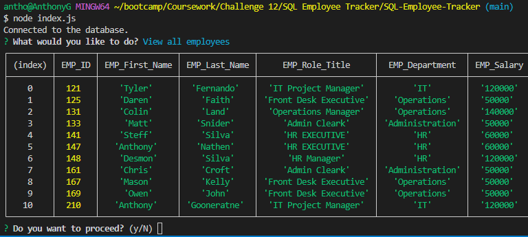

# SQL: Employee Tracker
Content Management System (CMS) for Maintaining Organizations Employee's Data

# Carleton University Coding Bootcamp Challenge 

## Bootcamp Module 12 Individual Challenge Assignment - SQL: Employee Tracker

Employee Tracker CMS allows the users to maintain and manage data related employees. It is a fully flege application which allows any organization to track and maintain its respective employees data.

## User Acceptance Criteria

* Command-line application that accepts user input.
* When the user is presented with the following options: view all departments, view all roles, view all employees, add a department, add a role, add an employee, and update an employee role.
* User should be able to view all departments, view all roles and view all employees in a readable format.
* User should be able to add new departments, employees and roles. 
* User should be able to update the employee information.
* User can view employees by manager.
* User can view employees by department.
* User can view the total utilized budget of a department—in other words, the combined salaries of all employees in that department.

## Requirements to view the code and the output

- VS Code with MYSQL Express JS, node js and the NPM package .
- OS - MS Windows, MAC or any other OS which supports GUI browser display.

## Usage

Screen layout is available in the repository path: 

## Credits

- Lecturer Gurneesh Singh for teaching us the module.
- Tutor Dru Sanchez for guiding me on the subjected matters.

  
## Features Links

- Application vedio demo URL: https://drive.google.com/file/d/1rZ6K6bmQjjsRdgFdNTPMlgY8jPLw63w8/view
- Github Repository url: https://github.com/anthogr45/SQL-Employee-Tracker